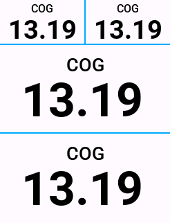
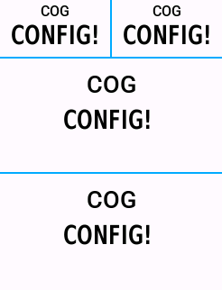

# Cog

Garmin Connect IQ data field for display currently selected cassette cog based on speed and cadence.

The data field uses the speed and cadence data from the Garmin device and uses it to calculate which cassette cog is being used.  When used on a bike with 2 chain rings it will show 2 numbers separated by a decimal point.  The first number is the cog if in the small ring, the second is the cog if in the big ring.  On a bike with a single chain ring only one number will be shown.

## Configuration

Before using the data field it must be configured with the details of the bike it will be used with.  These can be set using Garmin Express or the Garmin Connect mobile app.

#### Chain Rings

Enter the number of teeth on the chain ring.  For a bike with double chain rings enter both values separated by ;.  The small chain ring should be entered first.  3 chain rings are currently not supported.

#### Cogs

Enter the number of teeth on each cog of the cassette starting with the smallest cog.  Separate the values with ;.

#### Wheel Circumference

Enter the wheel circumference in meters.  The wheel circumference will be depend on the size of the wheels and tyres on the bike.  If unsure then search online for a bike wheel circumference chart.

### Configuration Error

If the configuration is invalid and not understood the data field will simply display CONFIG!

